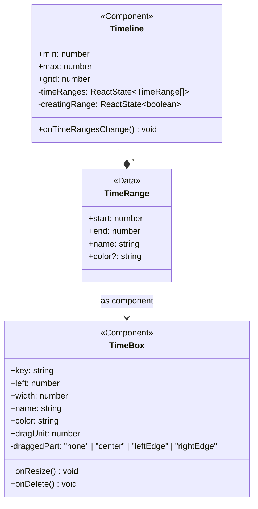
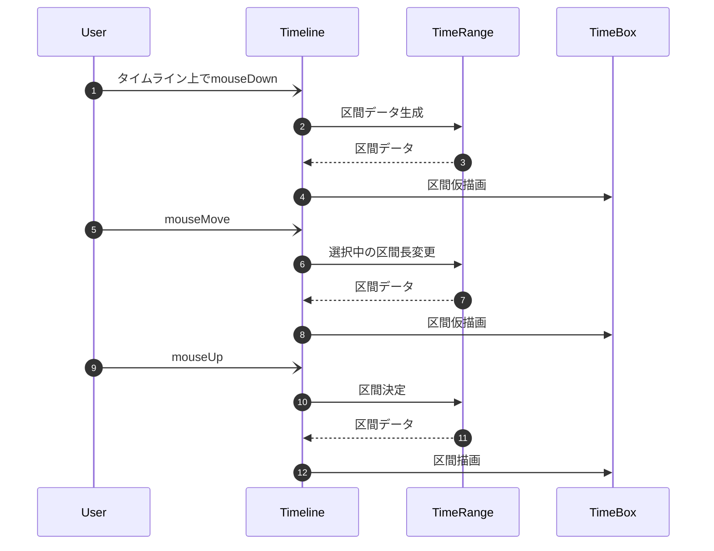
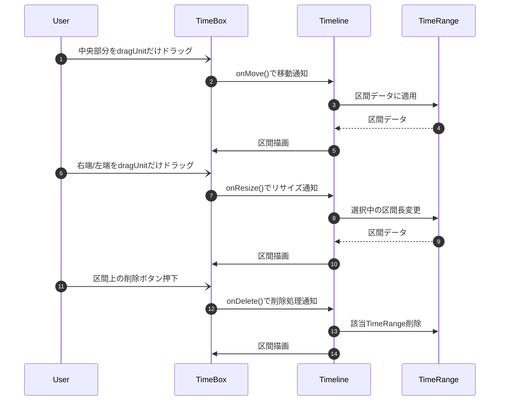

# 仕様

## 1. Overview

このライブラリは、動画編集ソフトなどで見られるタイムライン UI を React コンポーネントとして提供する。

任意の時間範囲（例：0〜24 時間、0〜10 秒など）を持つ数直線上に、複数の区間（`TimeRange`）をドラッグ操作により作成・表示・操作できる。

## 2. Features

- 任意の数値範囲を持つタイムラインの描画
- ラベルの任意フォーマットでの表示
- マウス操作による区間（`TimeRange`）の作成・移動・削除
- 区間の描画座標マッピング
- 区間ごとの色指定（初期色あり、変更可能）
- 軽量・依存関係最小

## 3. Data Model

## 4. Data Flow

### 区間作成

### 区間編集

## 5. Component Responsibilities

| コンポーネント名 | 役割                                                                              | 備考                                                             |
| ---------------- | --------------------------------------------------------------------------------- | ---------------------------------------------------------------- |
| `Timeline`       | タイムライン全体の描画とデータ管理を担当するメインコンポーネント。                | 新規区間の作成といった、タイムラインへのユーザーイベントを扱う。 |
| `TimeRange`      | 描画に必要な区間データ（開始・終了・色など）を管理する純粋データ構造。            | `Timeline`がこの Array を State として持つ。                     |
| `TimeBox`        | `TimeRange`のビューであり、移動や削除といった既存区間へのユーザーイベントも扱う。 | 座標や幅は`Timeline`が演算して props として与える。              |

## 6. API Design Policy

- 時間範囲の扱いは抽象的に「数直線上の区間」として設計し、単位は任意とする（時間・秒・フレームなど）。
  - 時間範囲の「意味」はフォーマット文字列によって外部から与える想定となる。
- スタイルは `style` prop で CSS 変数を介して外部からも調整可能。
